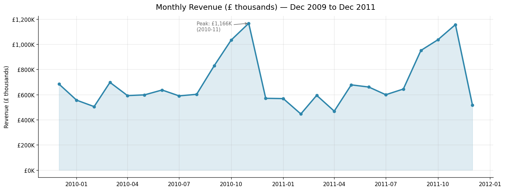
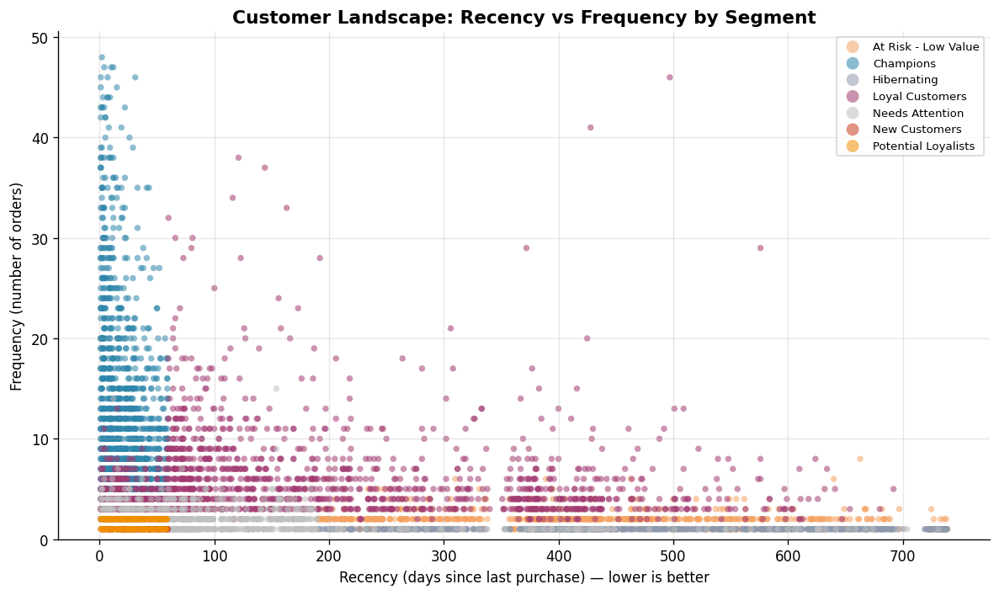
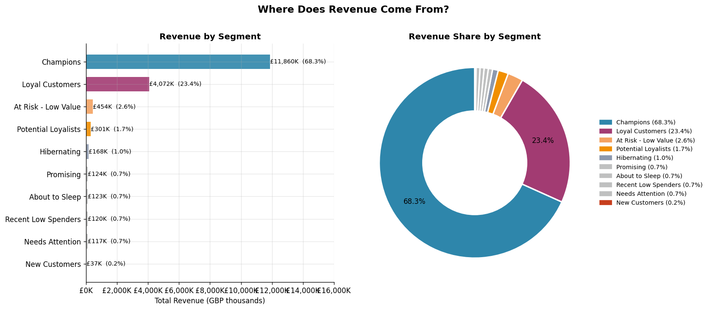
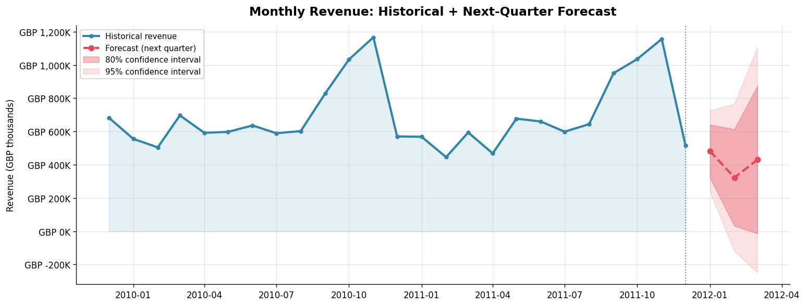
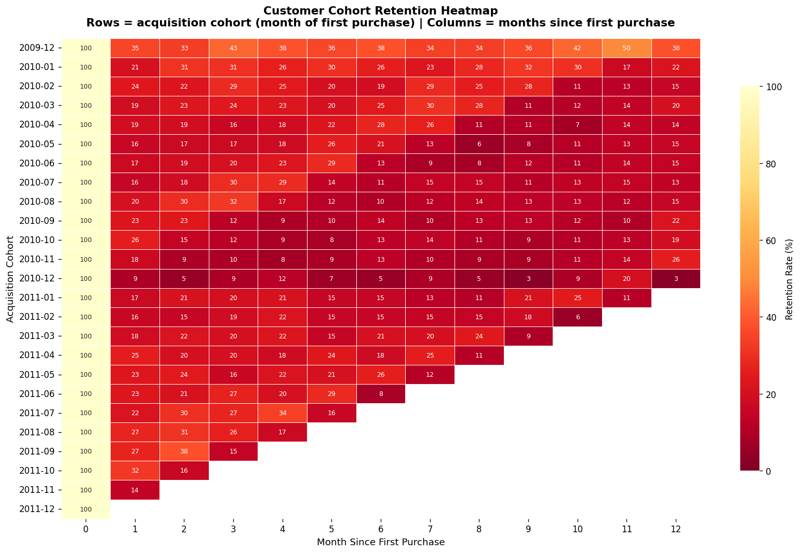
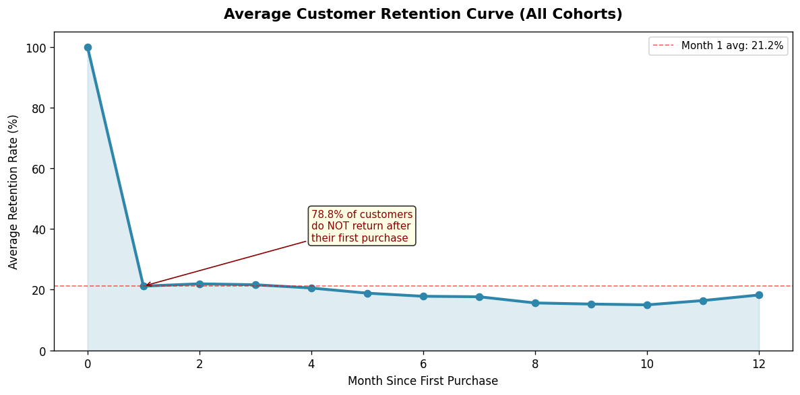

# Online Retail II — Customer Analytics

> RFM segmentation · Customer Lifetime Value · Revenue Forecasting · Cohort Retention  
> ~1M transactions · UK-based online retailer · Dec 2009 – Dec 2011

[](https://python.org)
[](LICENSE)

---

## The Business Problem

A UK gift retailer has two years of transaction history and no systematic view of which customers are driving revenue, which are at risk of churning, or where retention budget should go.

**Question:** Which customers are highest-value, which are lapsing, and where should retention investment go to get the best return?

---

## Dataset

| | |
|---|---|
| Source | [UCI ML Repository — Online Retail II](https://archive.ics.uci.edu/dataset/502/online+retail+ii) |
| Raw rows | 1,067,371 |
| After cleaning | 779,425 rows · 5,878 customers · GBP 17.4M revenue |
| Period | Dec 2009 – Dec 2011 (25 months) |
| Countries | 40+ |

**What was removed and why:**
- 243,007 rows with no CustomerID — can't build customer-level metrics without an ID
- 18,744 cancelled orders — negative quantities corrupt monetary metrics
- 26,124 exact duplicates

---

## Interactive Dashboard

Run locally with one command:

```bash
python app/dashboard.py
# then open http://127.0.0.1:8050
```

4-tab Plotly Dash dashboard — segment filter, forecast confidence bands, cohort heatmap, CLV ranking table.

---

## Analysis

### Revenue is highly concentrated



Clear seasonal spike every Oct–Nov (Christmas gifting demand). Top 20% of customers drive **77% of revenue**. Revenue drops sharply in Jan — inventory and staffing plans need to be set before November, not during it.

---

### RFM Segmentation — who your customers actually are



Each dot is a customer. Position = recency vs frequency. Size = total spend. Colour = segment.

Champions cluster top-left (frequent, recent). The long tail bottom-right is customers who bought once and disappeared — the biggest retention problem.



| Segment | Customers | Revenue | Avg Spend |
|---|---|---|---|
| Champions | 1,297 (22%) | GBP 11.9M (68%) | GBP 9,144 |
| Loyal Customers | 1,754 (30%) | GBP 4.1M (23%) | GBP 2,322 |
| At Risk - Low Value | 915 (16%) | GBP 454K (3%) | GBP 496 |
| Promising | 106 (2%) | GBP 124K (1%) | GBP 1,172 |
| Hibernating | 732 (12%) | GBP 168K (1%) | GBP 229 |

---

### Revenue Forecasting — SARIMAX



**Model:** SARIMAX(1,1,1)(1,0,1,12) on 25 months of monthly revenue. Seasonal differencing excluded — with only 25 data points, D=1 is unstable (consumes 12 observations for the lag alone).

**Holdout accuracy (Oct–Nov 2011):** 13.8% and 15.5% error.  
December is excluded from evaluation — the dataset ends on 9 Dec, so actual revenue is only 9 days of the month.

---

### Cohort Retention — where customers drop off



Each row = a group of customers acquired in the same month. Values = % who came back.

**The critical finding:** 78.8% of customers never make a second purchase. Month 0 → 1 is the single largest drop in the entire dataset. Customers who survive month 1 tend to stay — retention stabilises at ~18-22% through months 2–12.



---

## Key Findings

| Finding | Number |
|---|---|
| Revenue concentration | Top 20% of customers → 77% of revenue |
| Month 1 retention | Only **21.2%** of customers return after their first purchase |
| Champion avg spend | GBP 9,144 per customer (vs GBP 229 for Hibernating) |
| Seasonal swing | November is GBP 728K above the February baseline |
| At-risk revenue | GBP 4.5M from customers who used to buy but have gone quiet |

---

## What the Data Suggests

**1. Win back lapsing Loyal Customers first.**  
1,754 customers averaged 5.8 orders historically but haven't bought in ~6 months. That's GBP 4.1M in historical spend. A personalised reactivation campaign with a 15% conversion rate recovers ~GBP 350K.

**2. Protect Champions — don't discount them.**  
1,297 customers generate 68% of revenue. They buy without price incentives. Early access and recognition cost far less than replacing them.

**3. Fix the first-purchase drop-off.**  
A 30-day onboarding sequence (welcome → tips at day 7 → recommendation at day 21) targeting the Month 0→1 cliff is the highest-ROI CRM action available. Improving first-to-second purchase conversion from 21% to 30% adds ~500 retained customers per year without any extra acquisition spend.

---

## Reproduce

```bash
git clone https://github.com/AlyEl-Halawany/online-retail-analytics.git
cd online-retail-analytics
pip install -r requirements.txt

# Download raw data from UCI and place at:
# data/raw/online_retail_II.csv

python notebooks/01_eda.py
python notebooks/02_rfm_segmentation.py
python notebooks/03_clv_prediction.py
python notebooks/04_forecasting.py
python notebooks/05_cohort_retention.py

# Run the dashboard
python app/dashboard.py
```

---

## Stack

`pandas` · `scikit-learn` · `statsmodels` · `plotly` · `dash` · `matplotlib` · `seaborn`

---

## Limitations

- **Single retailer** — patterns are specific to this business. Revenue concentration and seasonal spikes are common in gift retail, but exact numbers shouldn't be assumed to generalise.
- **No marketing attribution** — the data doesn't include which campaigns customers received, so we can't measure campaign ROI.
- **No margin data** — revenue is gross (Quantity × Price). High-revenue segments aren't necessarily high-profit if margins differ by category.
- **CLV model R² = 0.026** — predicting exact future spend is hard in retail. The model's value is in *ranking* customers by value (feature importance: past spend = 93%), not precise prediction.
- **Short time series** — 25 months of monthly data is at the minimum viable range for seasonal modelling. Forecast confidence intervals are wide; treat them as directional planning input.
